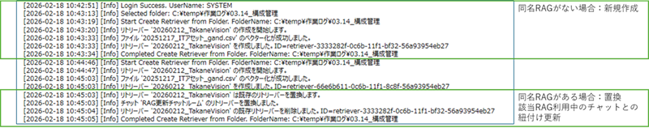

# 初めに
Fujitsu Cloud Service Genearative AI Platform の API を利用するための C# - WPF(.NET Framework) サンプルになります。  
実行ファイルはフォルダごとコピーすることでインストール作業なく Windows OS 環境で実行することができます。  
実行時の .NET Framework は、Windows 10 / 11 付属のものを利用します。

# 使い方
## 起動
1. SampleCSharpBulkRAGReg.exe をクリックして起動
2. 【初回起動時のみ】  
自動的にテナント名とクライアントIDを入力する [ 設定 ] 画面を表示するので、利用している Generative AI Platform 環境のテナント名とクライアント ID を入力して [OK] をクリックして保存してください。
3. 自動的にサインインが始まりますので、利用している EntraID の ID とパスワードを入力してください。

### [ 設定 ] 画面詳細
[ ファイル ]-[ 接続設定 ]メニューで接続情報を後から変更可能です。  

|  項目  |  用途  |
| ---- | ---- |
|  対話認証 | EntraID でサインインする場合に選択 |
|  TenantName | 契約時に通知されたテナント名 (gaXXXXXX) を設定 |
|  ClientId | 契約時に通知されたクライアントID |
|  (高度なオプション) | Menloなどブラウザ保護システムを採用するなど対話認証画面が表示できないときのみチェック |
|  非対話認証 | 秘密キーによる非対話が可能な契約時に選択 |
|  ClientSecret | 契約時に通知された秘密キーを設定 |

設定を変更した場合、自動的に接続が切断されるので、 [ ファイル ]-[ 接続 ]メニューをクリックして、新しい接続情報で設接続してください。

## RAG一括登録の操作
### フォルダ指定
[ ファイル ]-[ フォルダ指定 ] メニューをクリックして、RAG化するファイルを格納しているフォルダを指定します。  
- 指定したフォルダのサブフォルダがRAG名となります。
- サブフォルダに入っているファイルが、そのRAGの中に格納されるファイルとなります。
- サブフォルダの中が階層構造になっている場合も、階層内のファイルも自動的に格納していきます。

### 登録
フォルダを指定すると、画面右下の [ 登録 ] ボタンがクリックできるようになります。
クリックすると自動的に登録を開始します。
すべての処理が終わるまで、エラーメッセージなども「ダイアログ」ではなく、画面右側のログ表示に表示されるので、途中で止まってしまっていて処理が終わらないということはありません。

### 同名RAGの上書き置換について
すでに同名の RAG が登録されている場合、既存 RAG の内容を **すべて** 今回の内容に置換します。  
また、既存 RAG を利用しているチャットとの紐付けも、今回の内容に登録した RAG に切り替えます。

### 登録ログについて
登録時には、リトリーバー作成やファイルのベクター化についての動作ログが画面右側に自動的に表示します。  
画面表示内容は自動的にログファイルにも出力します。  
ログファイルは [ ドキュメント ] - [SampleCSharpBulkRAGReg] - [log] フォルダに日付付きで出力します。

# サンプルコードの build 方法
サンプルコードは、Visual Studio 2026 または、Visual Studio Code を使用して実行ファイルを build できます。
Visual Studio 2026 であれば、SampleCSharpUI.sln を開いていただければ、あとは UI 上で実行や build が可能です。
Visual Studio Code の場合は、環境設定などが必要です。

# 最後に
このサンプルが、Fujitsu Cloud Service Generative AI Platform を活用し、皆様のユーザーエクスペリエンスを飛躍的に進化させる革新的なアプリケーションを生み出すためのインスピレーションとなれば幸いです。  